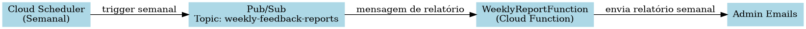

# gcp-weekly-report-function

## Descrição
A **Weekly Report Function** é uma **Cloud Function do GCP** que gera um **relatório semanal de feedbacks das aulas** e envia para os administradores cadastrados.

Ela é acionada **automaticamente pelo Cloud Scheduler** toda semana, publica uma mensagem no tópico **Pub/Sub** `weekly-feedback-reports`, que dispara a função. A função então:

1. Decodifica a mensagem recebida.
2. Busca os feedbacks da semana usando o serviço de Feedback.
3. Gera uma tabela HTML com as aulas mais avaliadas e mais populares.
4. Envia o relatório por email para todos os administradores.

---

## Fluxo da Função



---

## Stack / Tecnologias Usadas
- **Linguagem:** Java 17
- **Frameworks:** Google Cloud Functions Framework
- **Bibliotecas adicionais:**
    - Gson (JSON parsing)
    - Jakarta Mail (envio de emails)
- **Serviços GCP:**
  - Cloud Functions (execução da função)
  - Pub/Sub (trigger de mensagens)
  - Cloud Scheduler (agendamento semanal)
  - IAM / Service Accounts (permissões)
    - Cloud Logging (logs de execução)

---

## Pré-requisitos
- Conta GCP ativa e projeto configurado (fiap-adj8-feedback-platform)
- Java 17 instalado
- Google Cloud SDK (gcloud) instalado e autenticado
- Maven 3+ para build da aplicação

---

## Estrutura de Arquivos

```text
gcp-weekly-report-function/
├── src/main/java/fiap_adj8/feedback_platform/application/port/out/client/FeedbackServiceClientPort.java
├── src/main/java/fiap_adj8/feedback_platform/application/port/out/email/EmailSender.java
├── src/main/java/fiap_adj8/feedback_platform/application/port/out/email/input/EmailInput.java
├── src/main/java/fiap_adj8/feedback_platform/application/port/out/template/TemplateProvider.java
├── src/main/java/fiap_adj8/feedback_platform/domain/model/PubSubMessage.java
├── src/main/java/fiap_adj8/feedback_platform/infra/adapter/in/WeeklyReportFunction.java
├── src/main/java/fiap_adj8/feedback_platform/infra/adapter/out/client/FeedbackServiceClientAdapter.java
├── src/main/java/fiap_adj8/feedback_platform/infra/adapter/out/client/dto/LessonSummary.java
├── src/main/java/fiap_adj8/feedback_platform/infra/adapter/out/email/JakartaMailSender.java
├── src/main/java/fiap_adj8/feedback_platform/infra/adapter/out/template/TemplateLoader.java
├── src/main/java/fiap_adj8/feedback_platform/infra/helper/LessonSummaryTableBuilder.java
├── src/main/resources/templates/weekly-report.html
├── pom.xml
├── deploy.sh
└── README.md
```

## Permissões Necessárias

### Service Account de Deploy: sa-deploy-weekly-report

- roles/cloudfunctions.developer
- roles/pubsub.admin
- roles/cloudscheduler.admin
- roles/logging.viewer
- roles/storage.admin

### Service Account de Runtime: sa-runtime-weekly-report

- roles/pubsub.subscriber
- roles/logging.logWriter

Essas permissões permitem que a função execute corretamente, leia mensagens do Pub/Sub, gere relatórios, envie emails e registre logs.

---

## Deploy / Instalação
1. Tornar o script de deploy executável:
```bash
chmod +x deploy.sh
```

2. 📋 Configuração do .env

   O arquivo .env é necessário para fornecer variáveis sensíveis e URLs externas que a função Cloud Function precisa para operar.
   Crie o arquivo .env na raiz do projeto com o seguinte conteúdo (no mesmo nível que o arquivo deploy.sh):
```text
    # Feedback Service
    FEEDBACK_SERVICE_BASE_URL=https://fiap-feedback-app-dot-fiap-adj8-feedback-platform.uc.r.appspot.com
    FEEDBACK_SERVICE_AUTH=YWRtaW5AZW1haWwuY29tOmFkbWlu
    
    # SMTP Configuration
    EMAIL_SMTP_FROM=[SEU_EMAIL]
    EMAIL_SMTP_PASSWORD=[SUA_SENHA]
    EMAIL_SMTP_HOST=smtp.gmail.com
    EMAIL_SMTP_PORT=587

```    

    ⚠️ Importante: Substitua [SEU_EMAIL] e [SUA_SENHA] pelas suas credenciais reais de SMTP.
    Estas informações são utilizadas para envio de notificações por email pela função weekly-report.

3. Executar o deploy:

```bash
./deploy.sh
```

## ✅ O que o script faz

1. **Autenticação no GCP**
    - Autentica usando uma Service Account específica para deploy da função.

2. **Criação / Verificação do tópico Pub/Sub**
    - Verifica se o tópico `weekly-feedback-reports` existe.
    - Caso não exista, ele é criado automaticamente.

3. **Configuração de variáveis de ambiente**
    - Lê o arquivo `.env` local.
    - Gera um arquivo `env.yaml` usado pela Cloud Function durante o deploy.

4. **Deploy da Cloud Function**
    - Cria ou atualiza a função `weekly-report`.
    - Configura:
        - Runtime: Java 17
        - Trigger: Pub/Sub
        - Service Account dedicada
        - Memória: 512MB
        - Timeout: 60 segundos
        - Variáveis de ambiente seguras via `.env`

5. **Criação do Cloud Scheduler**
    - Cria (se não existir) um job agendado semanal:
        - Frequência: Domingo às 00:00
        - Timezone: America/Sao_Paulo
        - Envia mensagem automática ao Pub/Sub para disparar a função.

6. **Teste automático pós-deploy**
    - Envia uma mensagem de validação para o tópico Pub/Sub para garantir que a função está operacional.
